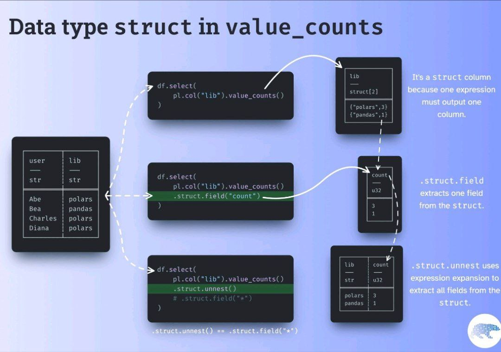

# Polars Colab 2025: Aggiornato a Polars v.1.20

- 00 Lazy Dataframe 

- 01 Reading CSV 

- 02 Selecting Data 

- 03 Noise 

- 04 Grouby 

- 06 String Operation 

- 07 Cleaning 

- 08 TimeStamp 

- 09 SQLdatabases 

- 10 Plots 

- 11 Polars on GPU 

- 12 Polars DuckDB & YahooFinance 

- 13 BIG-DATA: DuckDB & Polars with NY Taxi Full Dataset 

- 14 FireDucks vs Pandas vs Polars vs DuckDB 

Nobody tells you https://labs.quansight.org/blog/dataframe-group-by

["Differences in concepts between Polars and pandas"](https://docs.pola.rs/user-guide/migration/pandas/)

["this_repo_url"](https://github.com/Frenz86/PolarsColab2024)

